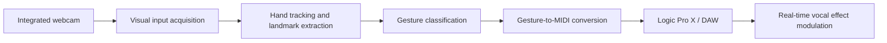
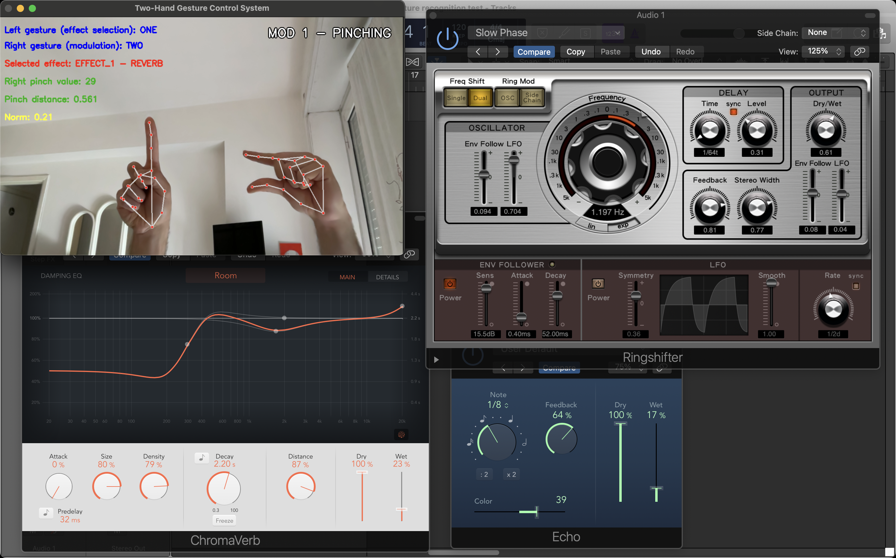

# G.R.I.M.P. — Gesture Recognition in Music Production

A real-time gesture-based interaction system for vocal production. The project allows a singer to use hand gestures to activate, deactivate and modulate audio effects on their voice during recording, without requiring external sensing devices or specific music production expertise.

The system uses the integrated camera of a personal computer as visual input. Hand landmarks are extracted and tracked in real time; the detected gestures are then converted into MIDI messages and transmitted to an audio engine, namely Logic Pro X, where they are mapped to effect parameters such as wet/dry intensity. The interaction is designed to support a more direct communication between the singer's expressive intention and the producer's technical manipulation of the vocal track.

---

## Project Purpose

The project aims to allow singers to handle their voice during recording by means of intuitive hand gestures. In a typical recording scenario, the singer may not possess the technical knowledge required to configure or manipulate production parameters directly. However, the singer often has a clear expressive perception of how their voice should be modulated at specific points in the track.

The proposed system addresses this gap by enabling the singer to trigger and control vocal effects, such as reverb or modulation, during the recording process. In this way, the producer can more easily understand the singer's desired vocal treatment and may use these real-time expressive indications as a source of inspiration during the production phase.

---

## Quickstart

Follow these steps to configure and run the project locally.

### 1. Installation

Clone the repository and install the required Python dependencies. The use of a virtual environment is recommended in order to avoid dependency conflicts.

```bash
git clone <repository-url>
cd <repository-name>

python -m venv .venv
source .venv/bin/activate

pip install -r requirements.txt
```
> [!WARNING]
> **DISCLAIMER:** Logic Pro X is a professional Digital Audio Workstation (DAW) developed exclusively for Apple computers running the macOS operating system. Consequently, to properly test the proposed interaction system an Apple-based hardware and software environment is required.

The implementation is based on the following technological workflow:

```text
Python + MediaPipe + OpenCV + OSC/MIDI + DAW
```

where:

| Component | Role in the system |
|---|---|
| Python | Main implementation environment |
| MediaPipe | Hand tracking and gesture recognition |
| OpenCV | Video acquisition, preprocessing and camera-feed visualization |
| MIDI / OSC command layer | Transmission of control messages toward the audio engine |
| Logic Pro X | Digital Audio Workstation used to manipulate effect-modulation parameters |

### 2. Configuration

Before running the system, verify the following configuration points:

1. the integrated webcam is enabled and accessible by the Python application;
2. Logic Pro X is open and configured as the target audio environment;
3. a virtual MIDI port, such as the IAC Driver, is available for communication between the Python application and Logic Pro X;
4. the MIDI Control Change messages generated by the system are mapped inside Logic Pro X to the intended audio-effect parameters, for example wet/dry intensity;
5. the desired interaction modality is selected according to the experimental condition to be tested.

### 3. Run the project

Launch the main application script:

```bash
python main.py
```

Once the system is running, the user performs gestures in front of the webcam. The gesture-recognition module detects the hands, extracts hand landmarks, classifies the gesture and infers the corresponding command to be sent to the audio engine.


## System Architecture

The system follows a real-time interaction pipeline based on visual input, gesture recognition and audio-effect control.



From the human perspective, the interaction is based on gestures. From the system perspective, these gestures are converted into MIDI inputs that are sent toward a Digital Audio Workstation.

The system provides multimodal feedback:

| Feedback type | Function |
|---|---|
| Auditory feedback | Main feedback channel. The user directly perceives the effect applied to their own voice. |
| Visual feedback | Secondary feedback channel. It supports gesture recognition awareness and system-state understanding. |

Auditory feedback is considered the most appropriate feedback channel in this context, because the user's perception of the system response is primarily connected to the audible transformation of their own voice.

---

## Related Works

The project is grounded in four main research areas: real-time hand tracking, gesture-to-audio mapping, vocal-performance augmentation and multimodal feedback in musical interaction.

| Area | Reference | Relevance to the project |
|---|---|---|
| Hand tracking and landmark extraction | **MediaPipe Hands: On-device Real-time Hand Tracking** — Fan Zhang et al. | Provides the scientific basis for real-time 21-landmark hand tracking on consumer devices, supporting accurate and stable gesture recognition without external sensors. |
| Gesture-to-audio and MIDI mapping | **The Wekinator: A System for Real-time, Interactive Machine Learning in Music** — Rebecca Fiebrink & Perry R. Cook | Demonstrates how gestural and audio inputs can be mapped to sound parameters in real time, supporting rapid prototyping of interactive musical systems. |
| Augmenting vocal performance | **A Voice Interface for Sound Generators: Adaptive and Automatic Mapping of Gestures to Sound** — Stefano Fasciani & Lonce Wyse | Shows that voice-related gestures can be used as a stable and expressive control mechanism for real-time sound synthesis. |
| Multimodal feedback in musical tasks | **Assessing the Influence of Multimodal Feedback in Mobile-Based Musical Task Performance** — Alexandre Clément & Gilberto Bernardes | Supports the design choice of prioritizing auditory feedback while using visual feedback as a secondary aid for orientation and system awareness. |

---

## Interaction Design

The system is designed as a multidimensional interaction mechanism because both hands are involved in the interaction. This allows the system to separate effect selection from effect modulation, improving consistency and supporting a more natural interaction model.

### Gesture-design requirements

The gesture vocabulary was defined according to the following requirements:

- distinguishability;
- memorability;
- ease of execution during singing;
- reduced fatigue;
- low probability of accidental activation;
- semantic consistency with the controlled effect.

Preliminary interviews were conducted with potential singers, or users familiar with the musical field, in order to present the design concept, collect feedback on the proposed gestures and evaluate possible alternatives. The final gesture design derives from the combination of these requirements and the observations that emerged during the preliminary interviews.

---

## Gesture Vocabulary

### Left hand — Effect selection

The left hand is used to select the target effect.

The user starts from a fist. The number of lifted fingers determines which effect is selected. For instance, lifting the first and second fingers corresponds to the selection of the second effect.

The fist represents the initial position. To switch from one effect to another, the user must always return to this initial position, which acts as a transition point. The same position can also be used to lock the amount of the selected effect once the desired value has been reached.

### Right hand — Effect modulation

The right hand is used to modulate the selected effect. Two alternative modulation strategies are implemented and compared. They are not handled simultaneously.

| Modality | Description | Interaction principle |
|---|---|---|
| Modality 1 — Pinch distance | The distance between the relevant fingers is mapped to a continuous modulation value. | The variation of pinch distance controls the intensity of the selected effect. |
| Modality 2 — Hand openness | The degree of hand opening is mapped to a continuous modulation value. | A closed hand corresponds to the minimum value, while a fully open hand corresponds to the maximum value. |

A dedicated reset gesture is used to turn off all effects at once. The two right-hand modulation strategies are compared in order to evaluate which interaction style provides the best balance between accuracy, responsiveness and perceived control in a vocal-performance scenario.


---

## Audio Engine and MIDI Control

The system uses MIDI Control Change messages to transmit continuous control information to the audio engine. MIDI CC messages allow real-time modulation of parameters such as volume, effect intensity and other audio-processing settings.

More specifically:

| MIDI element | Meaning |
|---|---|
| CC number | Identifies the parameter to be controlled |
| CC value | Represents the intensity of the controlled parameter |

The implementation uses the `mido` library to handle MIDI data and messages. The right-hand gesture is mapped into a continuous value in the range `0–127`. These values are sent in real time to Logic Pro X through a virtual MIDI port, namely the IAC Driver. Inside Logic Pro X, the incoming MIDI messages are mapped to effect parameters such as wet/dry, enabling dynamic and contactless modulation of the vocal processing chain during performance.

The system reacts only when it receives a signal that is stable enough over time. This design choice is introduced to reduce unintended fluctuations and improve the perceived reliability of the interaction.

---

## Feasibility and Technical Challenges

The overall gesture-based interaction is feasible using real-time hand tracking. However, the two modulation modalities differ in terms of stability, control precision and sensitivity to noise.

The most critical aspects are:

- tracking precision;
- stability of movement recognition;
- robustness during rapid movements;
- reduction of jitter in continuous gesture input;
- prevention of unintended variations;
- perceived responsiveness of the control mechanism.

For these reasons, filtering strategies are required to reduce jitter and accidental activation, especially when the user performs fast or unstable movements during singing.

---

## Evaluation Methodology

The effectiveness and reliability of the implemented system were evaluated through a testing procedure consisting of 10 operational tasks. The tasks were designed around a usage scenario in which a singer, while recording a vocal track, must activate, deactivate and modulate audio effects in real time through one of the two available interaction modes.

The evaluation is based on four binary-coded quantitative metrics.

| Metric | Definition | Success criterion |
|---|---|---|
| Accuracy | Measures whether the user is able to reach a specific value or action, for example 50% wet reverb. | The requested value or action is achieved within ±5% of the target. |
| Stability | Measures how much the value oscillates when the user tries to keep it still. | The value remains stable for at least 3 seconds within the tolerance range. |
| Error Rate | Measures the number of undesired activations. | No unwanted activation occurs. |
| Learnability | Measures how quickly the user understands how to perform the gesture. | The user autonomously understands the gesture at the first attempt, without assistance. |

---

## Experimental Results

The following table compares the performance achieved by the two interaction modalities.

> [!NOTE]
> **Validation Participants:** The experimental validation phase involved approximately ten participants with heterogeneous backgrounds and varying levels of familiarity with music production systems and gesture-based interaction. This preliminary evaluation was conducted to assess the usability, stability, learnability, and overall reliability of the proposed interaction modalities within a realistic vocal performance scenario.

| Metric | Modality 1 — Pinch distance | Modality 2 — Hand openness |
|---|---:|---:|
| Accuracy | 89/100 = 89% | 66/100 = 66% |
| Stability | 79/100 = 79% | 63/100 = 63% |
| Error Rate | 92/100 = 92% | 62/100 = 62% |
| Learnability | 87/100 = 87% | 66/100 = 66% |
| **Overall total** | **347/400 = 86.75%** | **257/400 = 64.25%** |

Overall, the results indicate that Modality 1, based on pinch distance, is the most effective, reliable and replicable interaction strategy. It achieves superior performance across all metrics: it is more accurate, more stable, less prone to unwanted activations and easier to learn.

By contrast, Modality 2, based on hand openness, shows weaker and less consistent performance. The most critical issue concerns error control: the Error Rate score is 62% for Modality 2, compared with 92% for Modality 1. This aspect is particularly relevant in a real-time musical scenario, where an undesired activation can compromise the continuity of the performance or inadvertently alter the resulting sound.


---

## References

[1] Fan Zhang et al., **MediaPipe Hands: On-device Real-time Hand Tracking**.  
https://arxiv.org/pdf/2006.10214

[2] Rebecca Fiebrink and Perry R. Cook, **The Wekinator: A System for Real-time, Interactive Machine Learning in Music**.  
https://archives.ismir.net/ismir2010/latebreaking/000012.pdf

[3] Stefano Fasciani and Lonce Wyse, **A Voice Interface for Sound Generators: Adaptive and Automatic Mapping of Gestures to Sound**.  
https://www.nime.org/proceedings/2012/nime2012_57.pdf

[4] Alexandre Clément and Gilberto Bernardes, **Assessing the Influence of Multimodal Feedback in Mobile-Based Musical Task Performance**.  
https://www.researchgate.net/publication/362546542_Assessing_the_Influence_of_Multimodal_Feedback_in_Mobile-Based_Musical_Task_Performance

---

## License

No license information is specified in the functional documentation. A license should be defined before public release of the repository.
